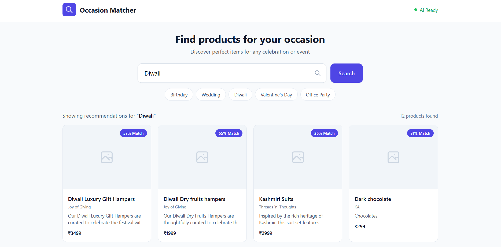

# Occasion-Based Product Recommendation System

An intelligent product recommendation system that suggests relevant products from a catalog based on user-entered occasions using semantic embeddings.

## Overview

Traditional e-commerce search often fails for occasion-driven queries because the exact occasion may not appear in a product's title or description. For example, searching for "Diwali" might not find a "Traditional Brass Diya" even though it's highly relevant.

This system uses **semantic embeddings** to understand the meaning behind occasion queries and match them with relevant products, regardless of exact keyword overlap.

## Features

- **Semantic Recommendations**: Uses sentence-transformers for meaning-based product matching
- **Ranked Results**: Returns products sorted by relevance score
- **Product Cards**: Displays title, category, description, image, brand, price, and match percentage
- **Quick Occasion Chips**: One-click suggestions for common occasions
- **Responsive Design**: Works on mobile, tablet, and desktop
- **Loading States**: Visual feedback while processing
- **Empty & Error States**: Graceful handling of edge cases

## Architecture

```
User enters occasion
        ↓
Frontend (HTML/JS)
        ↓
FastAPI Backend
        ↓
Sentence Transformer (all-MiniLM-L6-v2)
        ↓
Cosine Similarity
        ↓
Ranked Top-K Results
        ↓
Product Grid Display
```

## Technology Stack

| Layer | Technology |
|-------|-----------|
| Backend | FastAPI |
| ML Model | sentence-transformers (all-MiniLM-L6-v2) |
| Similarity | NumPy cosine similarity |
| Frontend | HTML + JavaScript |
| Styling | Tailwind CSS CDN |

## Setup Instructions

### Prerequisites

- Python 3.8+
- pip

### Installation

1. Clone the repository:
```bash
git clone https://github.com/yourusername/product-recommendation.git
cd product-recommendation
```

2. Install dependencies:
```bash
pip install -r requirements.txt
```

3. Run the application:
```bash
cd backend
python -m uvicorn main:app --reload --host 0.0.0.0 --port 8000
```

4. Open your browser and navigate to:
```
http://localhost:8000
```

## API Usage

### Health Check

```http
GET /health
```

Response:
```json
{
  "status": "ok",
  "catalog_count": 104,
  "model_loaded": true
}
```

### Get Recommendations

```http
POST /api/recommend
```

Request body:
```json
{
  "occasion": "Diwali",
  "top_k": 12
}
```

Response:
```json
{
  "occasion": "Diwali",
  "total_results": 3,
  "results": [
    {
      "product_id": "cml265ss000gcma01l3qqapo5",
      "title": "Diwali Luxury Gift Hampers",
      "category": "Gift Hampers",
      "description_snippet": "Our Diwali Luxury Gift Hampers are curated to celebrate...",
      "image_url": "https://example.com/image.png",
      "brand": "Joy of Giving",
      "price": "3499",
      "score": 0.5745
    }
  ]
}
```

## Recommendation Approach

### How It Works

1. **Product Text Construction**: Each product's meaningful fields (title, category, description, brand) are combined into a single text block.

2. **Embedding Generation**: At startup, all product texts are converted to dense vector embeddings (384 dimensions) using the `all-MiniLM-L6-v2` model.

3. **Query Processing**: When a user enters an occasion, it's converted to the same embedding space.

4. **Similarity Calculation**: Cosine similarity is computed between the query embedding and all product embeddings.

5. **Ranking**: Products are sorted by similarity score and the top-K results are returned.

### Why Semantic Embeddings?

Keyword matching fails when:
- Query: "Cocktail Party"
- Product: "Evening Blazer"

The product is relevant even without containing the exact query terms. Semantic embeddings capture this contextual relationship.

### Why Sentence-Transformers?

- No external API key required
- No API usage cost
- Local inference
- Reproducible results
- Suitable for semantic similarity tasks

### Why In-Memory?

For a catalog of ~100 products, an in-memory embedding matrix with dot product similarity is sufficient and avoids unnecessary infrastructure complexity.

## Libraries & Tools

This project uses the following open-source libraries:

| Library | Purpose | License |
|---------|---------|---------|
| [FastAPI](https://fastapi.tiangolo.com/) | Web framework for building the API | MIT |
| [Uvicorn](https://www.uvicorn.org/) | ASGI server for running FastAPI | BSD-3-Clause |
| [Sentence-Transformers](https://www.sbert.net/) | Semantic embedding generation | Apache-2.0 |
| [NumPy](https://numpy.org/) | Numerical operations and similarity calculation | BSD-3-Clause |
| [Pydantic](https://docs.pydantic.dev/) | Data validation and API models | MIT |
| [Tailwind CSS](https://tailwindcss.com/) | Utility-first CSS framework (via CDN) | MIT |

## Project Structure

```
product-recommendation/
├── backend/
│   ├── main.py          # FastAPI application
│   ├── recommender.py   # ML recommendation engine
│   ├── data_loader.py   # Catalog loading and normalization
│   └── models.py        # Pydantic models
├── frontend/
│   └── index.html       # Single-page UI
├── products.json        # Product catalog
├── requirements.txt     # Python dependencies
└── README.md           # This file
```

## Screenshots

### Occasion Input UI

<!-- Paste screenshot here -->


### Product Results

<!-- Paste screenshot here -->


## AI Assistance

This project was developed with the assistance of AI coding tools for implementation guidance, debugging support, and documentation. The final architecture, integration, testing, and code review were performed by the author.

## License

MIT License
